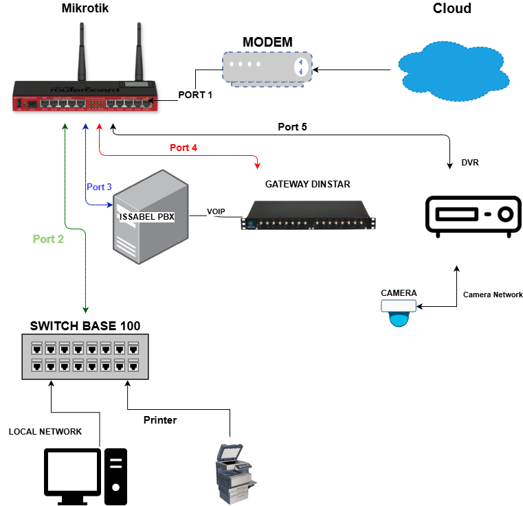
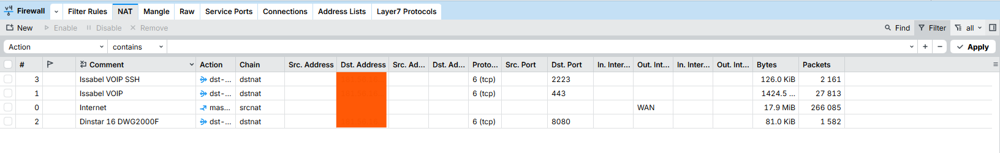
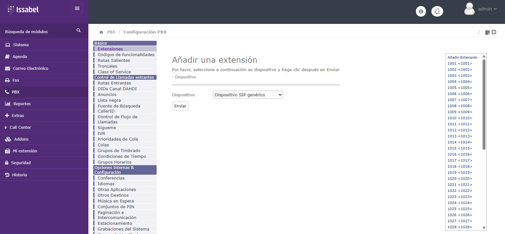
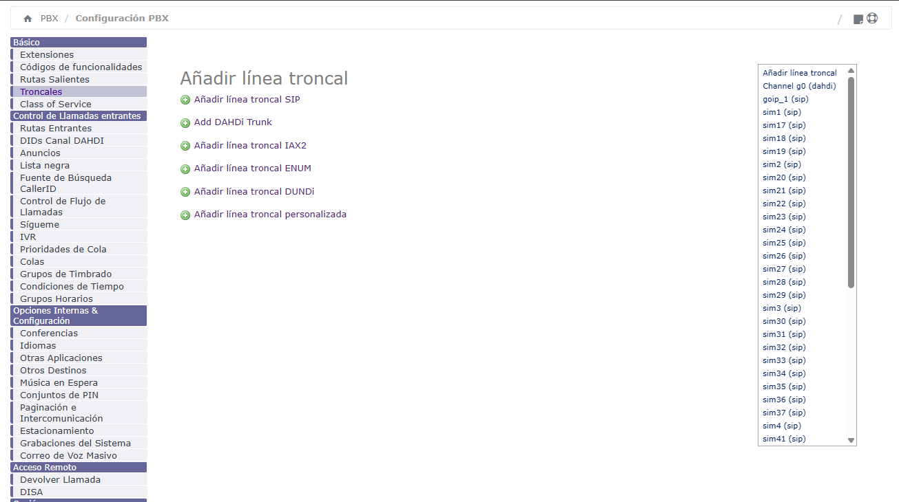
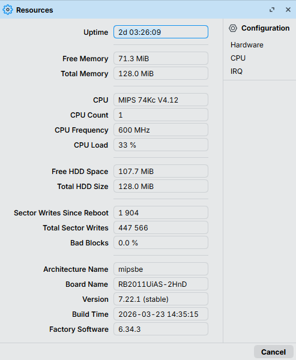

# Call Center Infrastructure Implementation

## 📌 Project Overview
End-to-End infrastructure deployment for a 16-agent operations center. This project highlights hardware optimization, achieving stable performance on an Intel i3-2120 with only 1% CPU usage.

---

## 🏗️ 1. Physical & Electrical Engineering
* **Power:** Biphasic load center and dedicated UPS for PBX/MikroTik core.
* **Cabling:** Structured cabling with **Panduit** management to prevent EMI.

---

## 🌐 2. Networking & Security
| Device | Role | Key Config |
| :--- | :--- | :--- |
| **MikroTik RB2011** | Core Router | Firewall Hardening, NAT Rules, Static WAN. |

---

## 📞 3. IP Telephony (Issabel/Asterisk)
* **Optimization:** Deep debloating of CentOS Minimal to handle 16 concurrent channels with recording.
* **Gateway:** 1:1 Port Mapping (SIM-to-Extension) for precise fault auditing.

---

## 📊 4. Efficiency Metrics
| Resource | Idle State | Operating State (16 Ch) |
| :--- | :---: | :---: |
| **CPU Usage** | **1%** | **Optimized** |
| **RAM Memory** | **600MB** | **No SWAP** |

