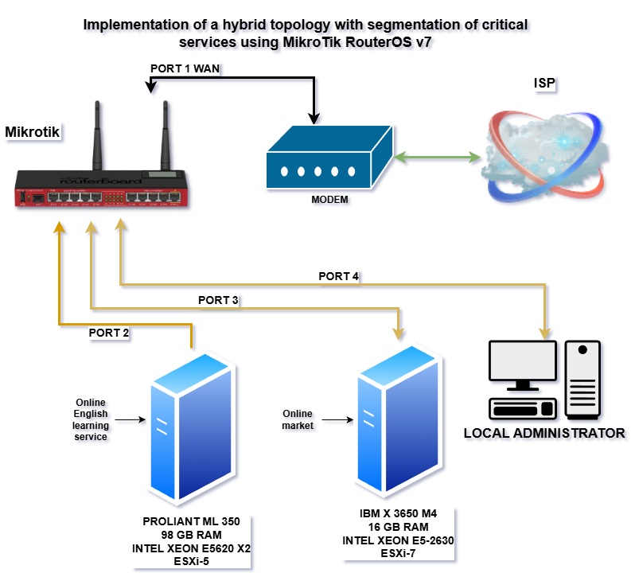
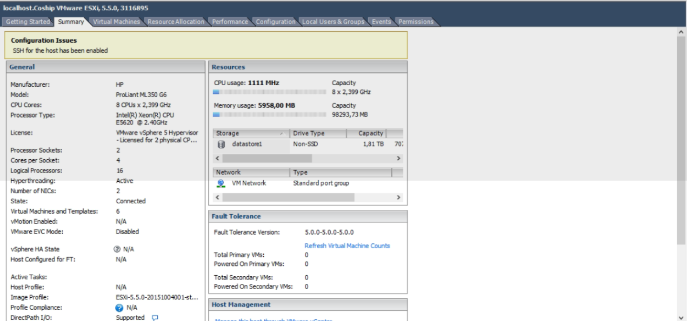
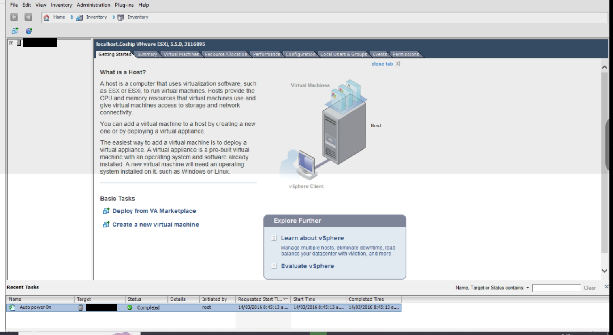
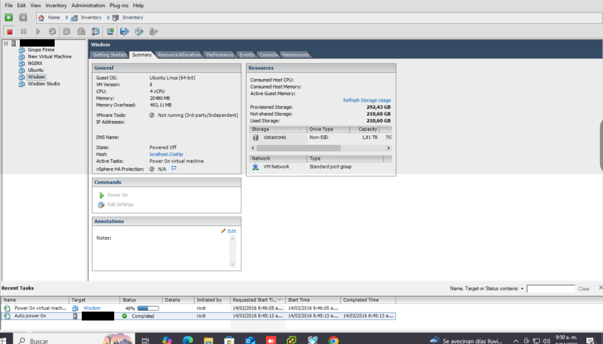
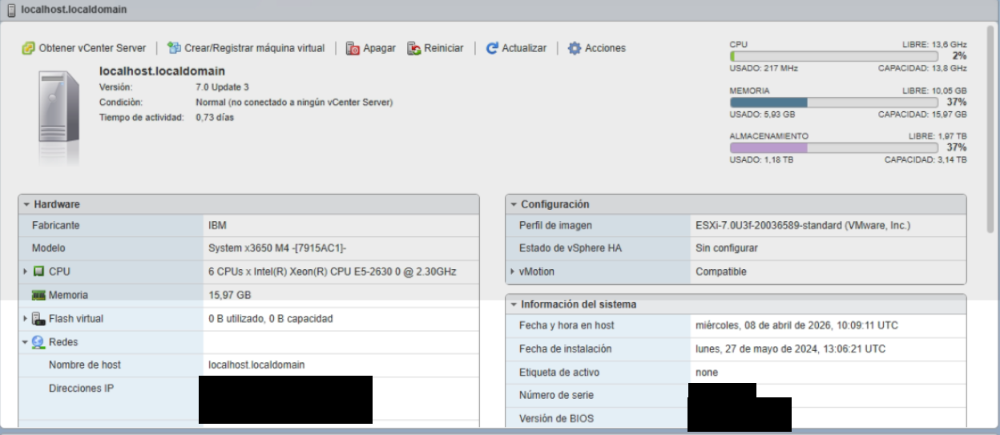
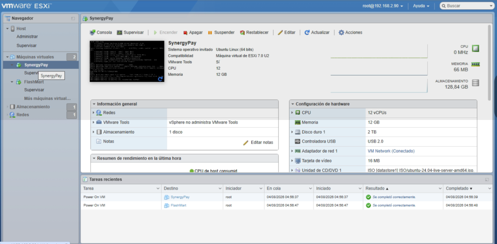
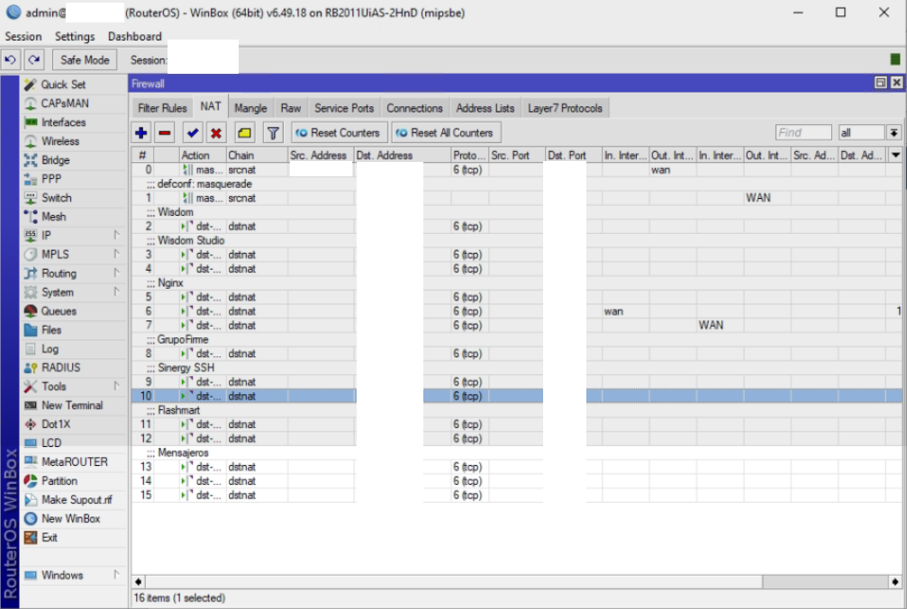

# Implementation of Corporate Hosting Service

## 📌 Project Overview
Deployment of an edge infrastructure using MikroTik RouterOS, segmenting critical services (Production Servers) and administrative management, with secure access through dynamic NAT rules.

---

##  1. Network Architecture (Port Layout)
* Ether1 (WAN): Connection to ISP (DHCP/Static).
* Ether2 (SRV-01): Proxmox/ESXi Server (Subnet 10.0.10.0/24).
* Ether3 (SRV-02): Proxmox/ESXi Server (Subnet 10.0.20.0/24).
* Ether4 (Admin PC): Acceso local restringido para gestión (192.168.88.0/24).
---

## 🌐 2. Virtualization Logic
Installation of ESXi 5 on HP Proliant M350 G6 server

Linux Ubuntu Server virtualization guaranteeing real processing power "4 real cores | 20 GB of RAM | 2 TB of SSD storage"

Installation of ESXi 7 on IBM System x3650 M4

CentOS 9 virtualization ensures stability in custom marketplace service

---

## 📞 3. Security and NAT

Default Drop: Anything not explicitly permitted is blocked.

DST-NAT: Mapping of specific ports (80, 443, etc.) to the internal IPs of the Virtual Machines.

Source NAT (Masquerade): For internet access for the entire network.

Secure DNS recursion configuration to prevent amplification attacks

