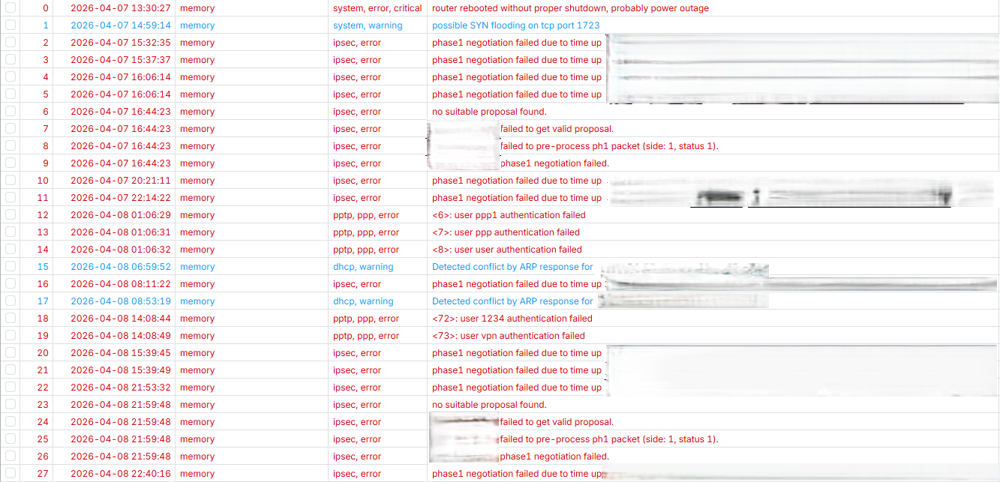
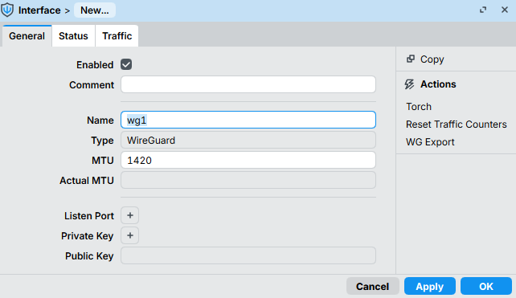
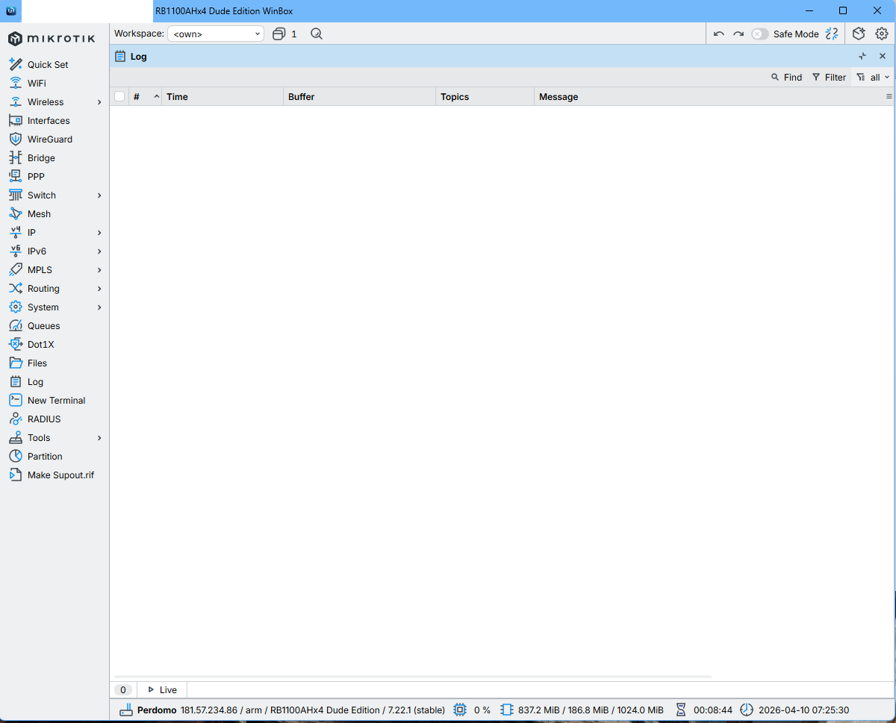
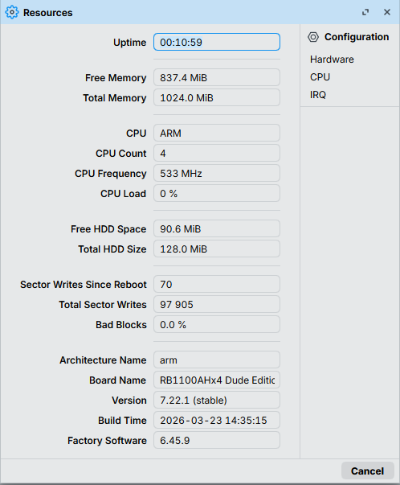

# Network Hardening & VPN Infrastructure Optimization
## (MikroTik Security Audit & WireGuard Implementation)

### 🚨 Problem Statement
The infrastructure was experiencing critical performance degradation due to external attack vectors:
* **VoIP Instability:** Choppy calls and packet loss.
* **Resource Exhaustion:** CPU load constantly at **85%**, affecting systemic latency.
* **Security Breaches:** Persistent brute-force attacks on legacy VPN protocols.

---

### 🔍 Root Cause Analysis (RCA)
Detailed audit revealed three primary vulnerabilities:
1. **Legacy VPN Exposure:** Outdated tunnels targeted by automated exploitation attempts.
2. **Brute Force Attacks:** Persistent attacks targeting management services, exhausting hardware resources.
3. **UDP Flooding:** Saturation of the connection table impacting IP telephony quality.

---

### 🛡️ Solution Implemented
A three-phase hardening plan was executed to stabilize the core:
* **Firewall Tightening:** Disabled non-essential WAN services and implemented strict filtering rules.
* **WireGuard Migration:** Deployed WireGuard for remote access, leveraging modern cryptography with minimal CPU overhead.
* **VoIP Optimization:** Cleaned NAT rules and adjusted firewall mangle rules to prioritize UDP voice traffic.

---

### 📊 Results
| Metric | Pre-Optimization | Post-Optimization |
| :--- | :---: | :---: |
| **CPU Load** | 85% (Saturation) | **1% (Optimized)** |
| **VoIP Quality** | Critical (Packet Loss) | **Fluid & Stable** |
| **Security State** | High Exposure | **Protected Perimeter** |

---

### 🛠️ Tech Stack
* **Hardware:** MikroTik RB1100AHx4 Dude Edition.
* **OS:** RouterOS v7.22.1 (Stable).
* **Protocols:** WireGuard (MTU 1420), Firewall Filter & NAT Rules.

---

### 📂 Evidences

*(Note: All evidence captures are in .png format to ensure cross-platform compatibility).*