# Full-Stack Infrastructure Overhaul: Security Remediation & VoIP Deployment

## Project Case Study
**Executive Summary:** A Call Center facility required an emergency intervention due to compromised network security, loss of administrative access to the PBX, and misconfigured VoIP gateways. The project involved a complete firmware sanitization of the core routing engine, password recovery for the PBX, and the deployment of a scalable VoIP architecture for 18 agents.
> 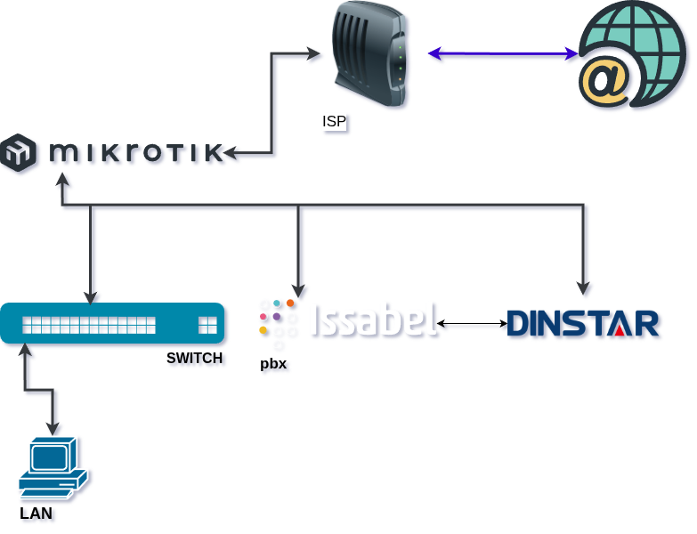

## 1. Diagnostics & Identification of Critical Issues
- **Security Breach:** The MikroTik router was compromised. The default "admin" account had been stripped of full privileges, and an unauthorized "system" user was executing malicious scripts (Persistence Mechanism).
> 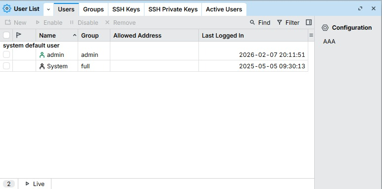
- **Access Lockout:** No administrative credentials or backups were available for the Asterisk-based Issabel PBX.
- **Legacy Configuration:** Dinstar GSM Gateways were mapped to a previous branch's network logic, rendering them unusable for the current site.
- **Physical Layer Degradation:** Non-certified, damaged patch cords in the rack caused intermittent Layer 2 connectivity issues.
> 

---

## 2. Solution Phase I: Network Sanitization (MikroTik)
Given the active script-based attack and compromised public IP, a standard factory reset was deemed insufficient.
- **Bare-Metal Restoration:** Executed a clean firmware installation via **Netinstall**, upgrading the OS from version `6.34.3` to `7.22.1 (Stable)`.
- **Hardening:**
    - Eliminated the default "admin" user.
    - Disabled vulnerable/unnecessary services: `API`, `SSH`, `Web`, `Telnet`, `WWW-SSL`, `FTP`.
    - Implemented a **WireGuard Site-to-Site VPN** for secure remote management.
    - VLAN segmentation and strict Firewall Filter Rules to prevent future unauthorized access.

---

## 3. Solution Phase II: PBX Recovery & VoIP Logic (Issabel/Asterisk)
- **Credential Escalation:** Recovered the Linux `root` account via GRUB/single-user mode to reset Issabel HTTP/Admin access.
- **Network Re-addressing:** Reconfigured the IP stack via `nmtui` to align with the new secure VLAN segment.

- **SIP Architecture:** - Created 18 unique SIP extensions for call center agents.
    - Configured independent SIP Trunks for each **Dinstar** port (1:1 mapping logic) to optimize outbound routing and port-specific SIM management.

> 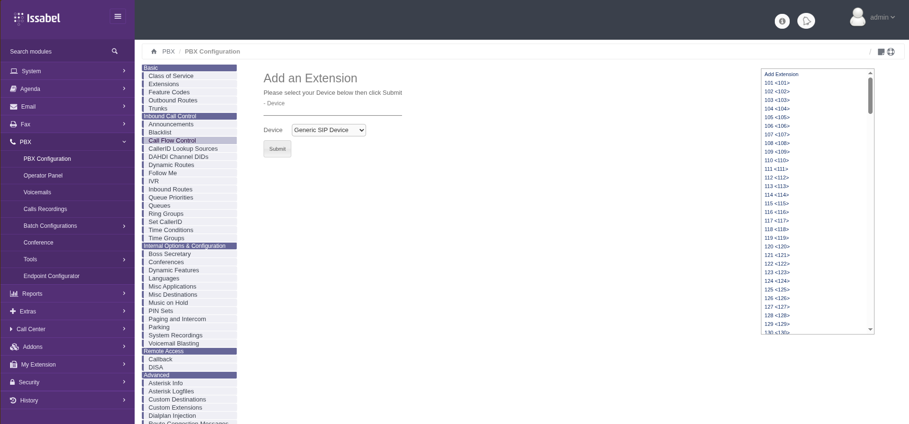

> 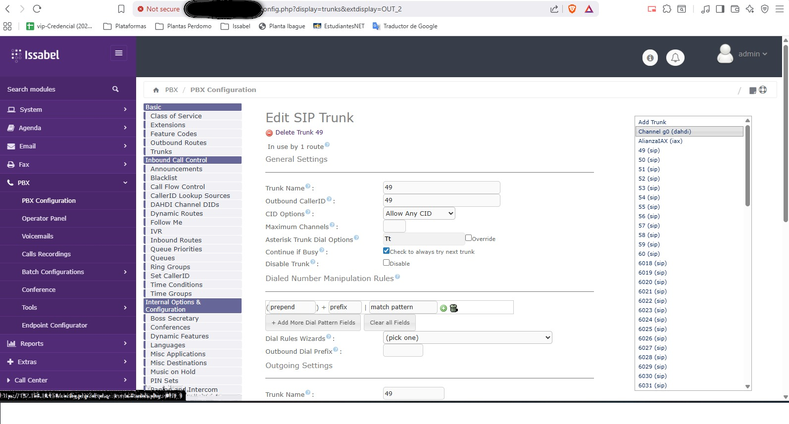

> 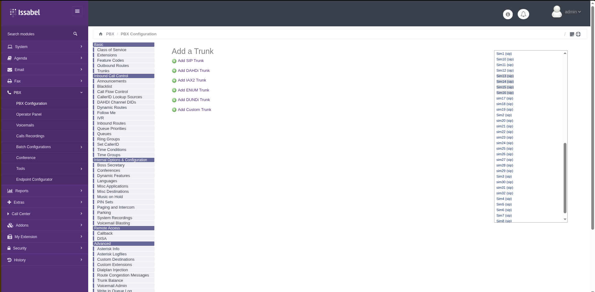

> 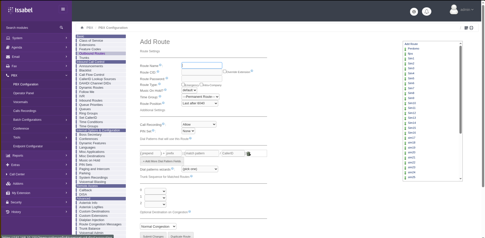

---

## 4. Solution Phase III: GSM Gateway Integration (Dinstar)
- **Provisioning:** Reset and re-addressed Dinstar devices with static IPs within the management VLAN.
- **SIP Trunking:** Established a peer-to-peer SIP trunk with the Asterisk server.
- **SIM Management:** Configured logical port groups, outbound dial patterns, and validated GSM signal integrity for all SIM slots.
- **Validation:** Conducted end-to-end call testing to ensure low latency and high audio quality.
> 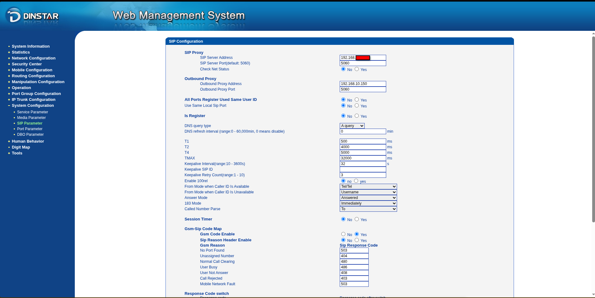
> 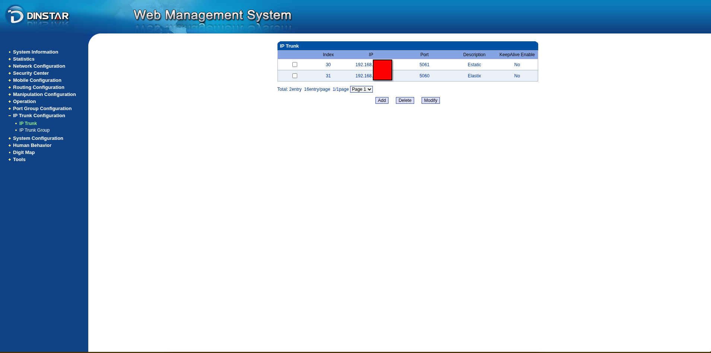
> 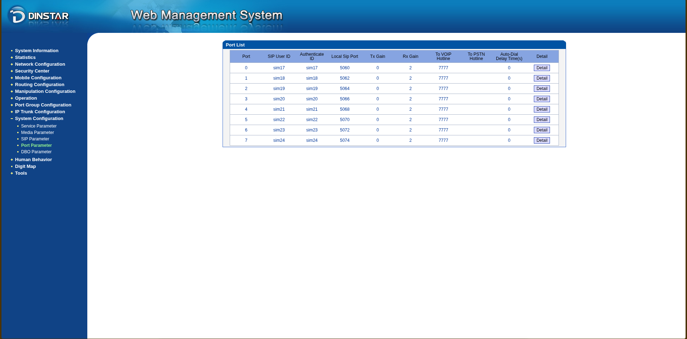
> 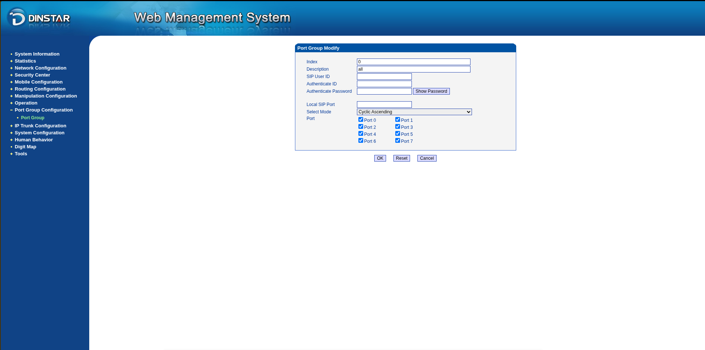
> 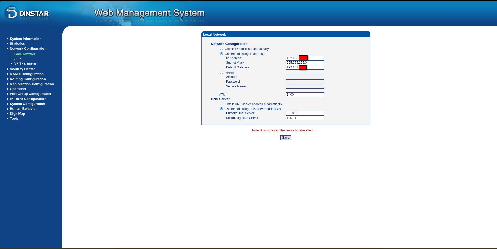

---

## 5. Solution Phase IV: Endpoint & Physical Layer
- **Physical Layer (Layer 1):** Performed a "Rack Cleanup." Replaced non-certified cables with **Siemens Cat 6 certified patch cords**. Labeled all nodes for future maintenance.

> 

- **Workstation Configuration:** - Audited 18 agent PCs running **Linux Mint MATE**.
    - Provisioned **Linphone** as the primary softphone client, configured with the new SIP credentials and optimized codecs (G.711/G.729).

---

## 6. Solution Phase V: Secure Inter-Site Connectivity (WireGuard VPN)
To ensure secure remote administration and branch interconnectivity without exposing internal services to the public internet, a Site-to-Site VPN was deployed.
> 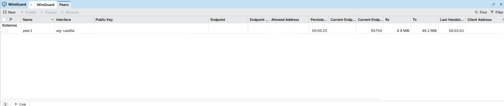
> 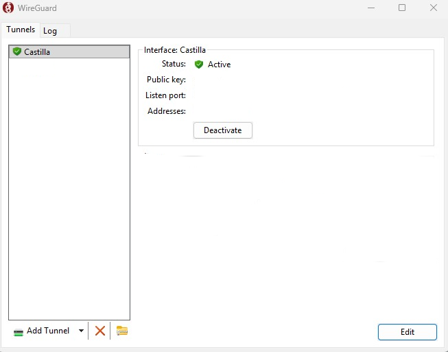

### Technical Implementation
1. **Protocol Selection:** Chosen **WireGuard** due to its state-of-the-art cryptography (ChaCha20, Poly1305) and superior throughput compared to IPsec or OpenVPN.
2. **Interface Configuration:** - Generated Public/Private key pairs directly on the MikroTik (RouterOS v7).
    - Configured a dedicated WireGuard interface with a `/30` or `/24` private transit network.
3. **Peer Establishment:** - Defined "Allowed IPs" to strictly permit traffic only from authorized internal subnets, preventing routing loops and unauthorized lateral movement.
    - Configured Keep-alive packets to maintain the NAT traversal persistent through the firewall.
4. **Firewall Integration:** Created specific Input and Forward rules to allow UDP traffic on the WireGuard Listen Port, while dropping all other unauthenticated requests.

*(Image placeholder: WireGuard Interface status and Peer handshake verification)*

---

## Key Technical Proficiencies
- **Network Security:** Malware script identification, firmware reflashing (Netinstall), and stateful firewall configuration.
- **VoIP/Telephony:** Asterisk/Issabel administration, Dinstar GSM Gateway configuration, and SIP trunking.
- **Linux Administration:** RHEL/CentOS password recovery and Linux Mint workstation deployment.
- **VPN Technologies:** Implementation of high-performance **WireGuard** tunnels.
- **Infrastructure:** Professional rack cable management and hardware auditing.

---

## Security Compliance Note
To protect client confidentiality and infrastructure integrity, all sensitive identifiers (Public IPs, specific company names, MAC addresses, and private VPN keys) have been redacted or replaced with generic placeholders in this documentation.