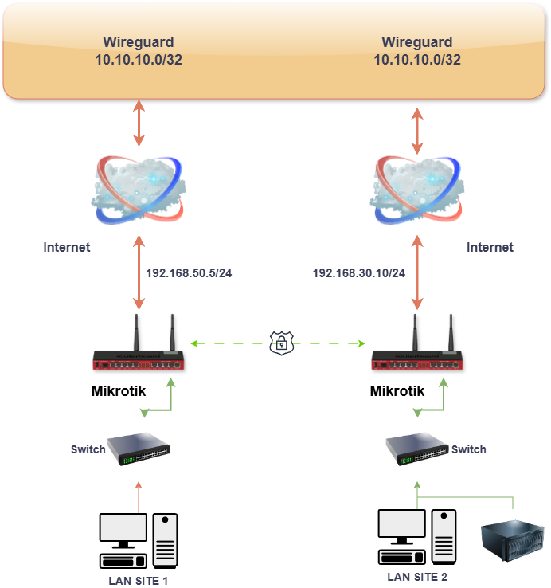
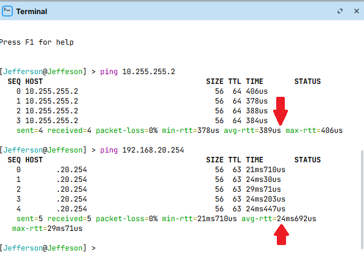
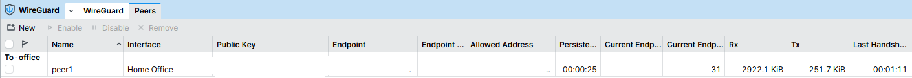
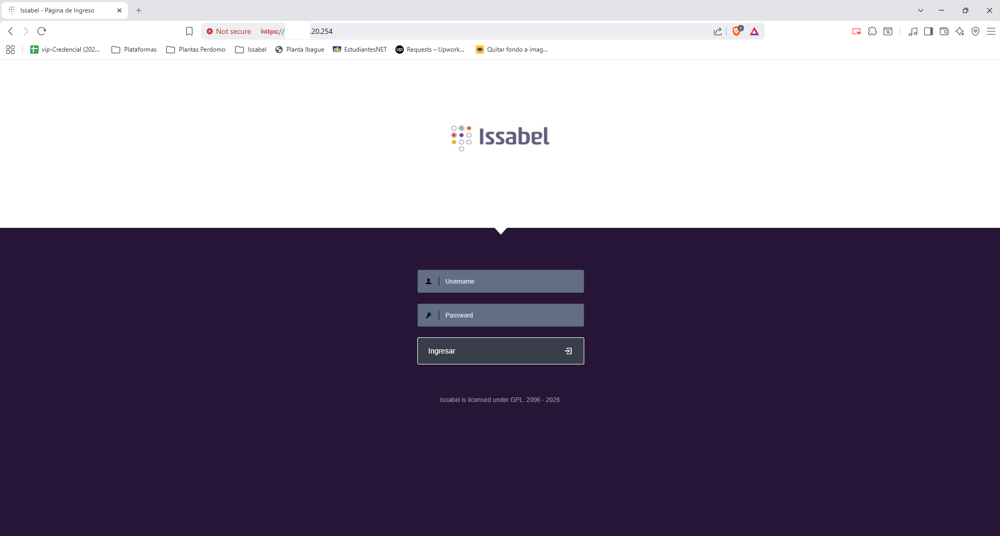
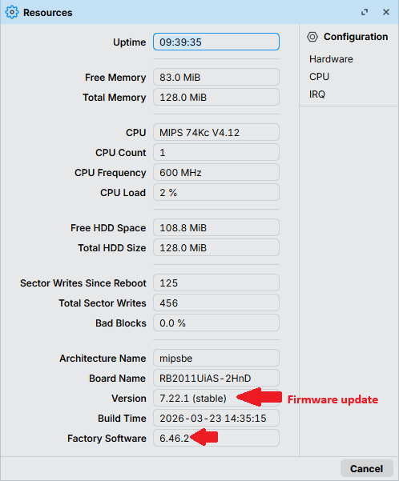

# Secure Site-to-Site VPN Infrastructure Implementation (WireGuard)

## Project Overview
This project involved the design and deployment of a high-performance Virtual Private Network (VPN) to securely interconnect two corporate offices. The primary goal was to enable transparent, encrypted data flow for critical services, including IP Telephony (Issabel) and infrastructure management, leveraging MikroTik hardware.

## Technical Challenges Resolved
* **Hardware Optimization:** Advanced configuration on MikroTik RB2011 devices to ensure a stable tunnel with CPU usage below 10%.
* **Military-Grade Security:** Implementation of the WireGuard protocol to ensure end-to-end encryption of sensitive data.
* **Transparent Bidirectional Routing:** Configuration of routing tables and Firewall rules (Layer 3/4) to enable "Client-to-Client" communication without public network exposure.
* **Connectivity Persistence:** Keep-alive strategies and dynamic IP handling to ensure 99.9% uptime.

## Solution Architecture

> 

## Visible Results
### 1. Remote Service Interconnectivity
Full local access to internal services at the remote site (Issabel PBX, Servers, Security Cameras) was achieved.

> 
> 
> 
### 2. Hardware & Encryption Efficiency
Load tests demonstrate that encryption does not penalize device performance.

> 

## Conclusion
The implemented solution eliminates the need for third-party remote access tools (such as AnyDesk or TeamViewer), centralizes administration, and most importantly, protects corporate data integrity against external threats.